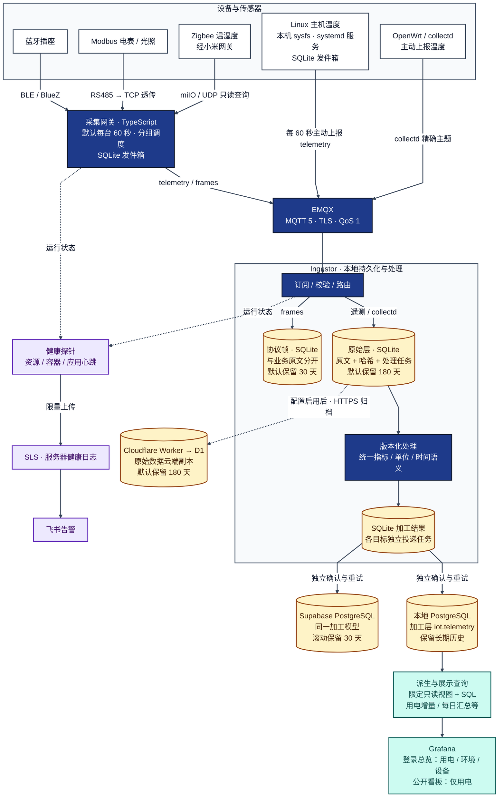
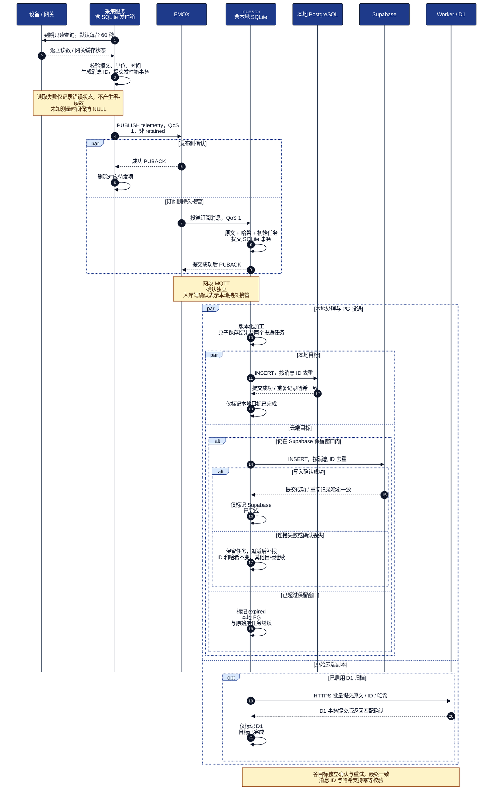

# oneMiniHouse 架构与采集时序

根据当前代码整理的逻辑架构，采用白底、深色边框与文字、深蓝服务节点和黄色存储节点。
只使用通用名称；不包含真实设备地址、账号、云项目标识或分享链接。
配置启用状态与线上健康情况需另行核验。

## 架构图

- 采集服务按通道分组调度；同一串行组内逐台查询。默认间隔为每台 60 秒，慢设备可能使同组后续轮次延后。
- OpenWrt 的 collectd 直接发布到 MQTT，由精确主题映射进入原始层，不经过 Node 网关的发件箱。
- Linux 主机在本机读取内核开放的温度通道，由独立受限 systemd 服务通过 MQTT 主动上报；断网缓存到本机 SQLite，成功 PUBACK 后删除待发项。每台主机使用独立发布账号，入库端只订阅，不通过 SSH 拉取温度。
- 本地 PostgreSQL 和 Supabase 由投递任务独立写入，不是数据库主从复制，也不是跨库原子事务。
- 派生数据目前在视图与 Grafana SQL 查询时计算，没有单独的预计算汇总服务。
- 图中的 SLS 链路用于服务器健康日志。协议帧独立保存在 SQLite；其 SLS 归档属于另行配置的可选能力。
- 原始层 180 天为默认保留策略，未完成的本地任务会暂时阻止对应原文清理；队列另有容量限制。
- 网关发件箱是待发缓存，默认最多 7 天或 10 万条，PUBACK 后删除；EMQX 持久会话也有服务端容量及有效期限制。

## 采集与双写时序图

以采集网关的一条有效 telemetry 消息为例。Linux 主机本地温度服务沿用相同信封与发件箱流程；collectd 的接入从 MQTT 订阅侧开始。
协议帧、retained 最新状态与健康日志走独立路径，此图聚焦业务原文和加工结果。

PUBACK 不表示两个 PostgreSQL 已全部提交。目标连接故障保留任务并重试，
永久数据错误进入失败状态等待处理；同 ID 不同哈希不会覆盖已有记录。
Grafana 使用专用只读角色查询本地限定视图，公开看板只允许用电展示。
